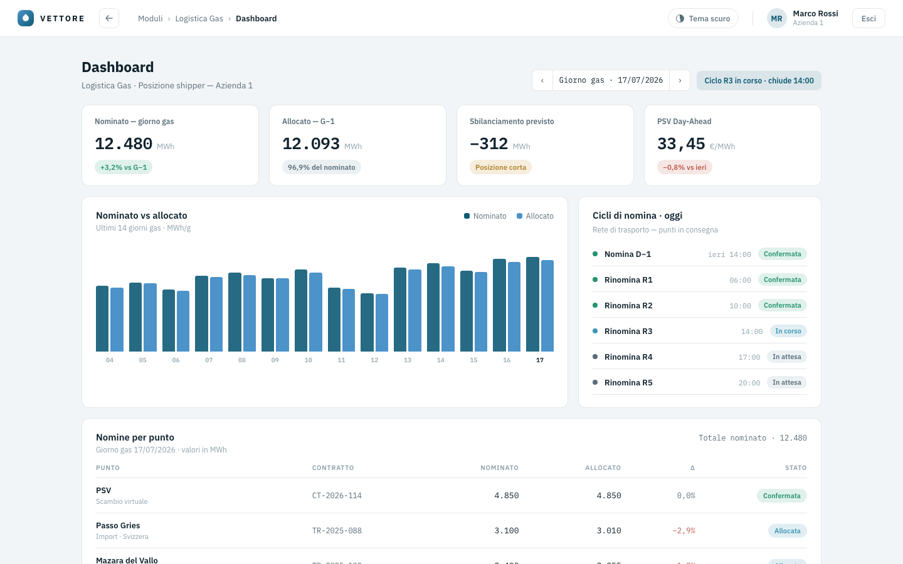
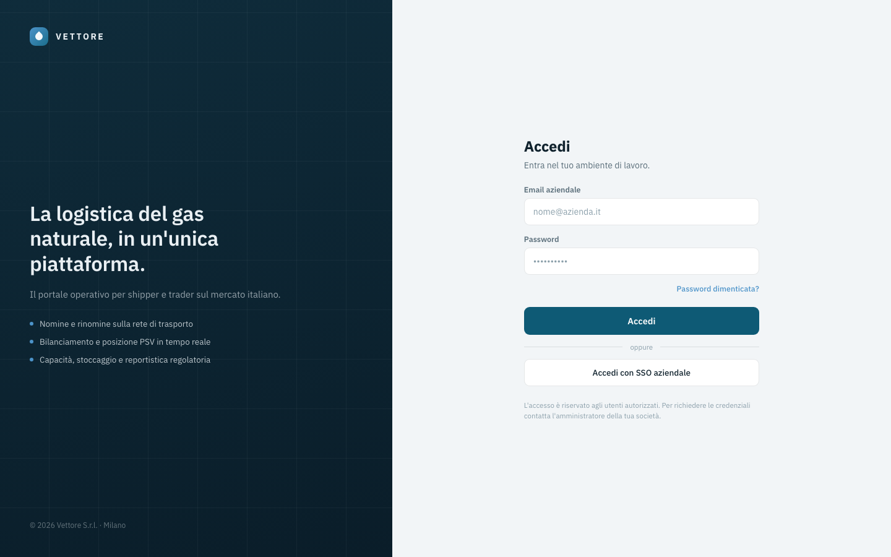
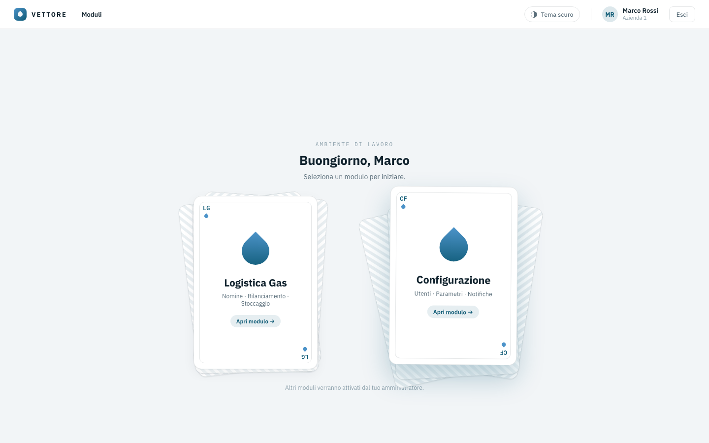
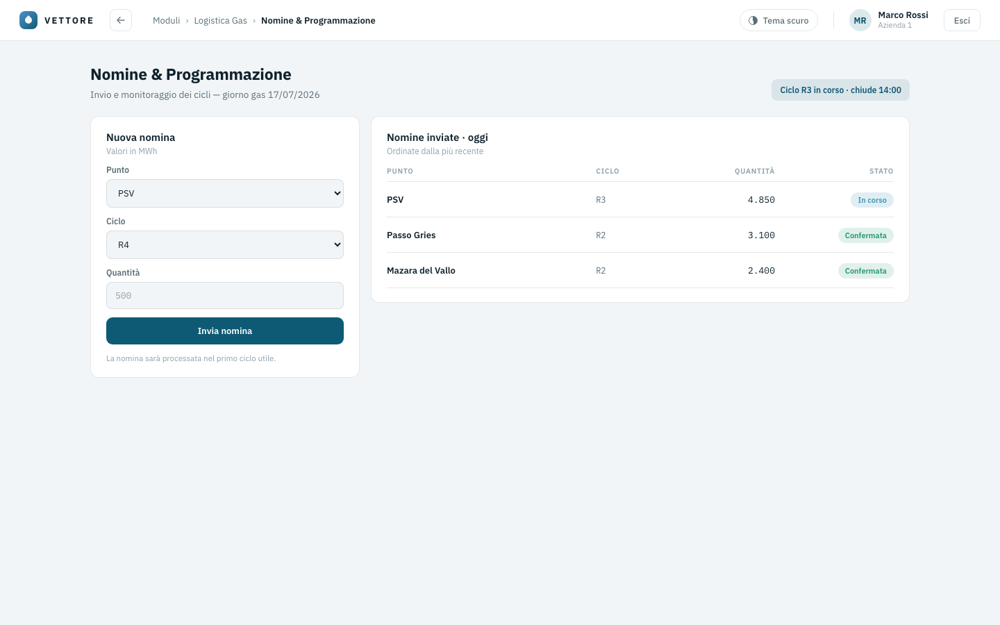
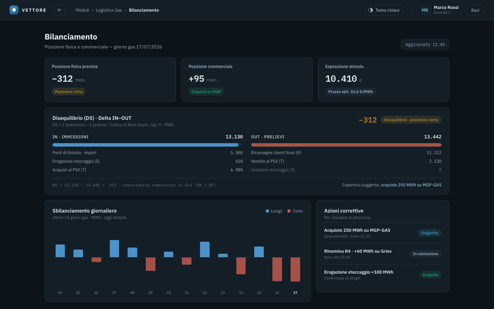
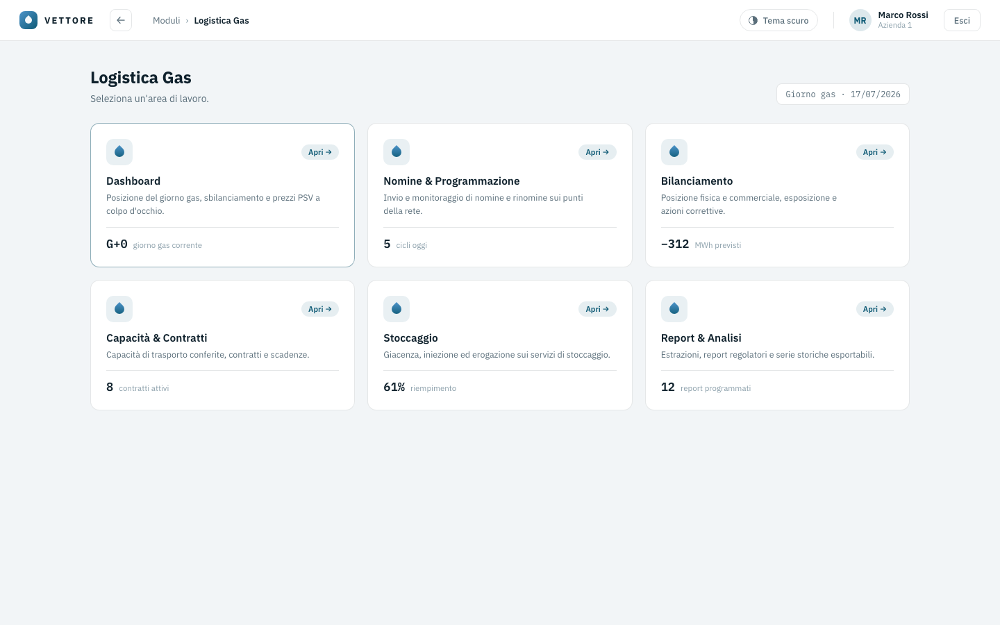
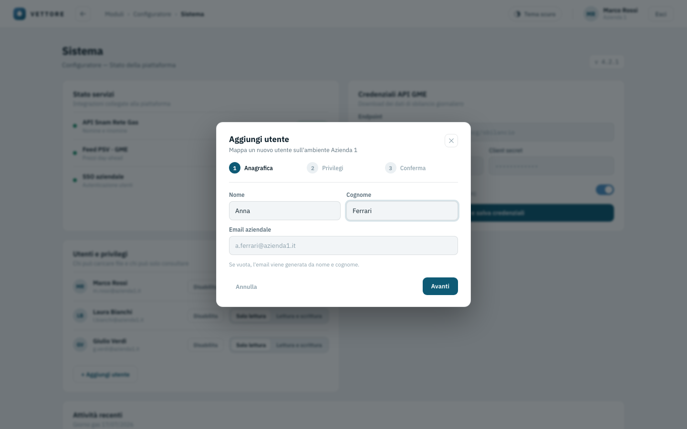
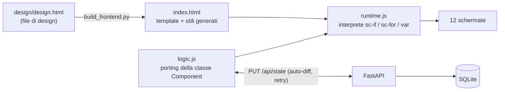

<div align="center">

# Vettore — Portale Logistica Gas

**Il portale operativo per shipper e trader di gas naturale sul mercato italiano.**
Nomine, bilanciamento, capacità, stoccaggio e reportistica regolatoria — in un'unica piattaforma.

*A demo web portal for natural-gas shippers on the Italian market: nominations, balancing, capacity, storage and regulatory reporting.*

[](https://github.com/It-Energy-Ai/Logistica_Gas_Natural_Up_Stream/actions/workflows/ci.yml)
[](LICENSE)
[](requirements.txt)
[](app/main.py)
[](app/static/runtime.js)



</div>

---

## Le schermate

| | |
|:---:|:---:|
| <br>**Login** · email/password o SSO aziendale con scelta account | <br>**Hub** · moduli come carte da gioco, con effetto mazzo all'hover |
| <br>**Nomine** · invio per punto/ciclo, storico del giorno gas | <br>**Bilanciamento** · disequilibrio DS, azioni correttive — tema scuro |
| <br>**Logistica Gas** · sei aree di lavoro | <br>**Configuratore** · utenti con wizard a 3 passi, credenziali GME |

E inoltre: **Capacità & Contratti** (anno termico, utilizzo, scadenze d'asta), **Stoccaggio** (giacenza, fattori di adeguamento Stogit, movimenti), **Report & Analisi** (filtri per categoria, invii programmati), **Impostazioni impresa** (anagrafica shipper, parametri di nomina, punti di consegna, notifiche).

## Dal design all'app funzionante

Questo progetto nasce da un design d'interfaccia completo e lo trasforma in una webapp reale **senza riscriverne l'interfaccia**: il markup del canvas è preservato al carattere.



- **`design/design.html`** — la fonte di verità dell'interfaccia.
- **`build_frontend.py`** — genera il frontend: converte gli pseudo-stili (`style-hover`/`style-focus`) in CSS e applica le poche deviazioni documentate (campi login controllati, effetto hover del hub in CSS puro).
- **`runtime.js`** (~150 righe, zero dipendenze) — interpreta il template a runtime: condizioni, cicli, interpolazioni, eventi.
- **`logic.js`** — porting quasi letterale della logica del canvas, con 6 deviazioni documentate in testa al file (API reali, persistenza, robustezza della sync).

Per modificare l'interfaccia: si aggiorna design/design.html e si rilancia `python3 build_frontend.py`. La CI verifica che il frontend generato resti allineato al design.

## Avvio — scegli la strada che preferisci

**Docker non è un requisito**: è solo una delle tre opzioni.

### 1 · Eseguibile pronto (niente da installare)

Scarica dalla pagina [**Releases**](https://github.com/It-Energy-Ai/Logistica_Gas_Natural_Up_Stream/releases) il file per il tuo sistema — Windows, macOS (Intel o Apple Silicon) o Linux — e fai doppio click: il browser si apre da solo su <http://localhost:8080>. Nessun Docker, nessun Python, nessun terminale. I dati restano in `~/.vettore/vettore.db`.

> macOS al primo avvio: tasto destro → *Apri* (il binario non è firmato). Windows: se SmartScreen avvisa, *Ulteriori informazioni → Esegui comunque*.

### 2 · Script di avvio (serve solo Python 3.11+)

```bash
./avvio.sh        # macOS / Linux
avvio.bat         # Windows (doppio click)
```

Al primo avvio crea da solo l'ambiente e installa le dipendenze, poi apre il browser.

### 3 · Docker (per chi lo usa già)

```bash
docker compose up -d --build      # → http://localhost:8080
```

## Cosa è reale e cosa è demo

| Reale | Demo |
|---|---|
| Navigazione, tutte le interazioni, wizard, tema chiaro/scuro | Dati di mercato (KPI, prezzi PSV, giacenze) ancorati al giorno gas 17/07/2026 |
| Sessioni con cookie, login/logout | Login e SSO accettano qualunque credenziale |
| **Persistenza SQLite** di nomine, configurazione, punti e utenti (sopravvivono al riavvio) | Integrazioni Snam / GME / SSO: interfacce pronte, nessuna chiamata ai sistemi veri |
| Sync client→server con retry, gestione sessione scaduta, validazione a whitelist | |

La colonna "demo" è la mappa esatta di cosa sostituire per andare in produzione.

## Test e qualità

```bash
.venv/bin/pip install -r requirements-dev.txt
.venv/bin/pytest              # 8 test API: sessioni, validazione, persistenza
node tests/logic.test.cjs     # 18 test logica: navigazione, nomine, wizard, sync
```

Il codice è passato da una revisione multi-agente (4 lenti indipendenti + verifica avversariale di ogni segnalazione): tutti i difetti confermati sono stati corretti e coperti da regressione — inclusa la sincronizzazione col backend, che ora accoda e ritenta invece di perdere modifiche su errori di rete o sessione scaduta.

## Licenza

[MIT](LICENSE) · © 2026 It-Energy-Ai
