<div align="center">

# Vettore — Portale Logistica Gas

**Il portale operativo per shipper e trader di gas naturale sul mercato italiano.**
Nomine, bilanciamento, capacità, stoccaggio e reportistica regolatoria — in un'unica piattaforma.

*A demo web portal for natural-gas shippers on the Italian market: nominations, balancing, capacity, storage and regulatory reporting.*

Un progetto di **[Davide Bellini](https://github.com/It-Energy-Ai)** · It-Energy-Ai

[](https://github.com/It-Energy-Ai/Logistica_Gas_Natural_Up_Stream/actions/workflows/ci.yml)
[](https://github.com/It-Energy-Ai/Logistica_Gas_Natural_Up_Stream/releases/latest)
[](https://github.com/It-Energy-Ai)
[](LICENSE)
[](requirements.txt)
[](app/main.py)
[](app/static/runtime.js)

### ⬇️ Scarica l'applicazione pronta

| [**Windows**](https://github.com/It-Energy-Ai/Logistica_Gas_Natural_Up_Stream/releases/latest/download/Vettore-windows.exe) | [**macOS** (Apple Silicon)](https://github.com/It-Energy-Ai/Logistica_Gas_Natural_Up_Stream/releases/latest/download/Vettore-macos-apple-silicon) | [**Linux**](https://github.com/It-Energy-Ai/Logistica_Gas_Natural_Up_Stream/releases/latest/download/Vettore-linux) |
|:---:|:---:|:---:|

Un file solo, doppio click, il browser si apre da solo. **Niente Docker, niente Python, niente terminale.**
Questi collegamenti puntano sempre all'ultima versione · [note di rilascio](https://github.com/It-Energy-Ai/Logistica_Gas_Natural_Up_Stream/releases/latest) · [SHA256SUMS](https://github.com/It-Energy-Ai/Logistica_Gas_Natural_Up_Stream/releases/latest/download/SHA256SUMS.txt)

> Il pulsante verde **Code ▾ → Download ZIP** qui sopra scarica invece il **codice sorgente** (`…-main.zip`), che serve a chi vuole leggere o modificare il progetto. Per usare l'applicazione servono i file qui sopra.

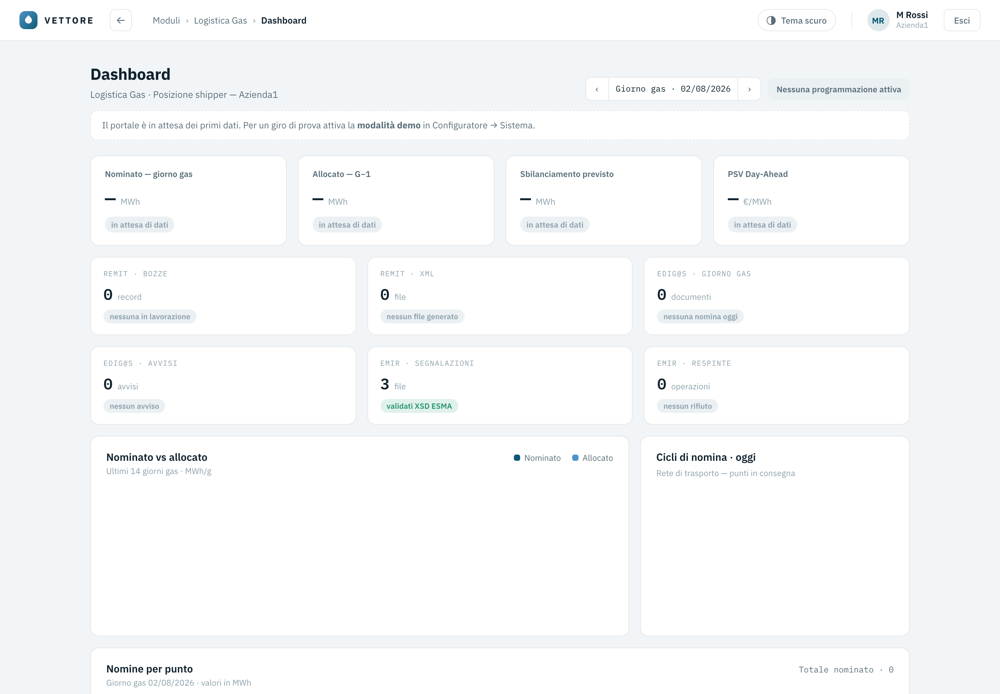

</div>

---

## Le schermate

<div align="center">
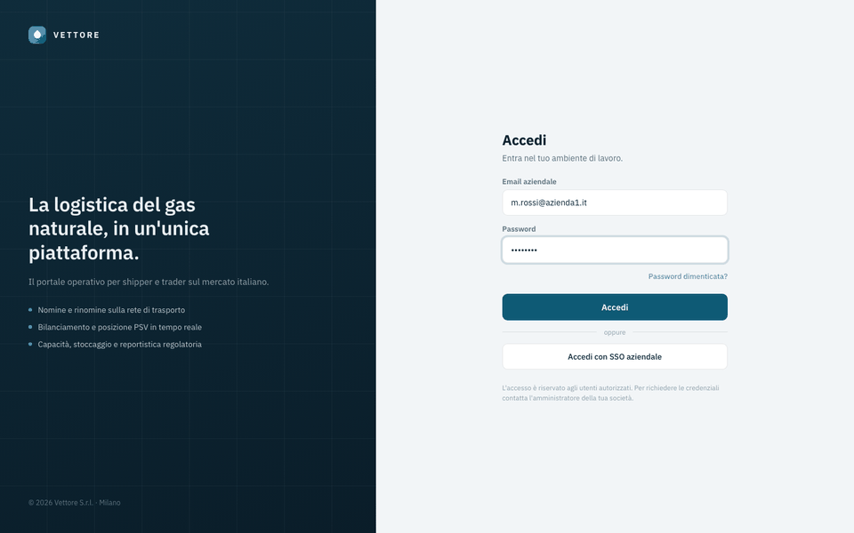
</div>

| | |
|:---:|:---:|
| 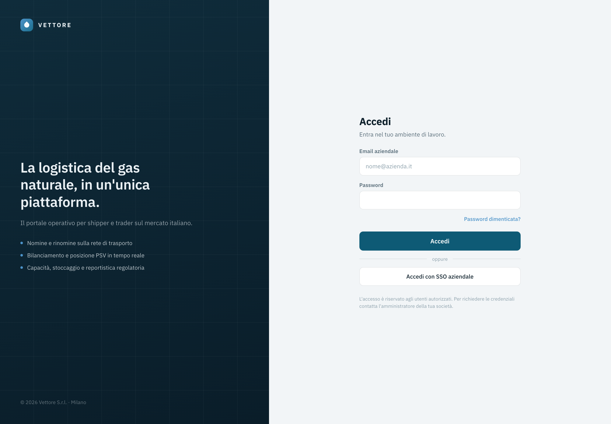<br>**Login** · email/password o SSO aziendale con scelta account | 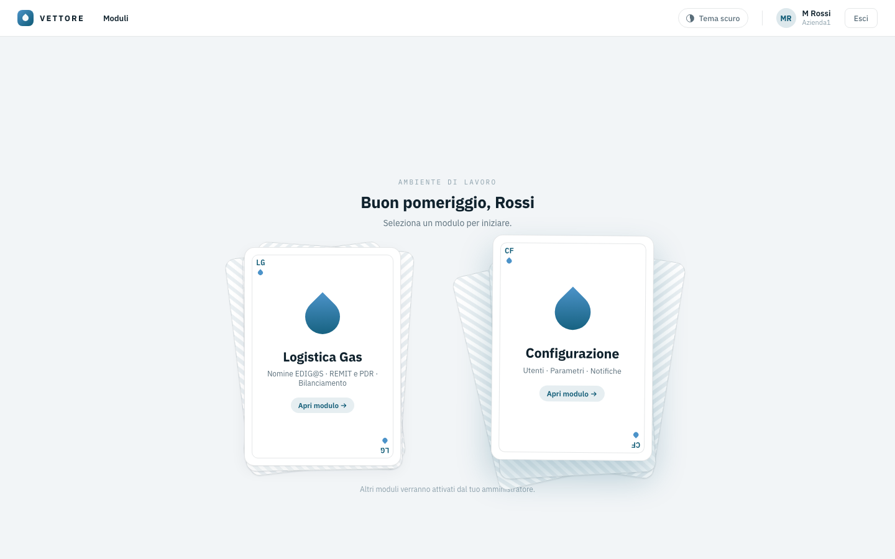<br>**Hub** · moduli come carte da gioco, con effetto mazzo all'hover |
| 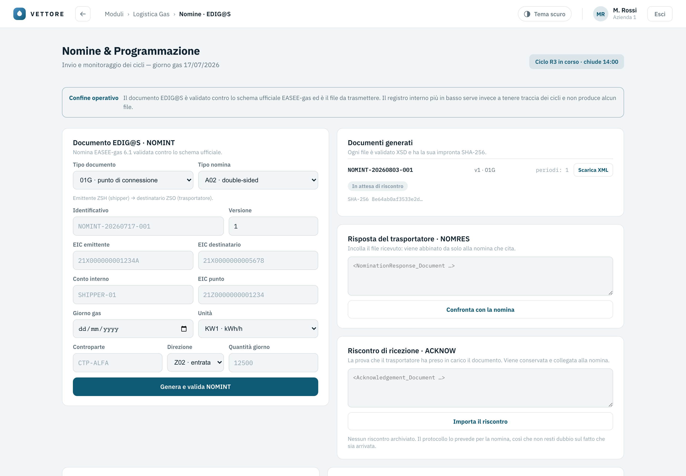<br>**Nomine** · documento EDIG@S 6.1 validato e registro interno dei cicli | 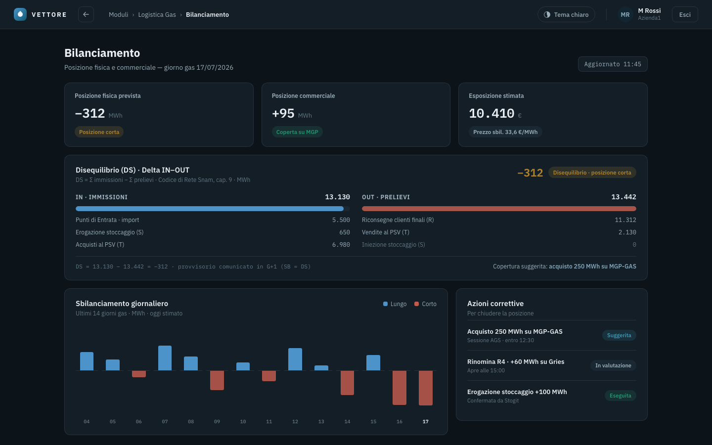<br>**Bilanciamento** · disequilibrio DS, azioni correttive — tema scuro |
| 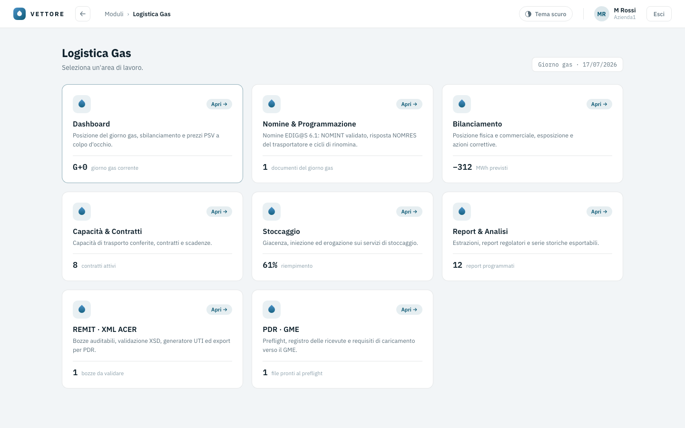<br>**Logistica Gas** · aree di lavoro operative | 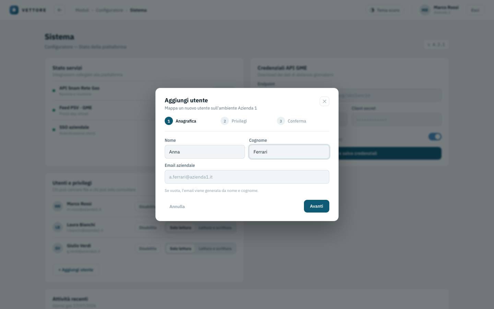<br>**Configuratore** · utenti con wizard a 3 passi e impostazioni locali |
| 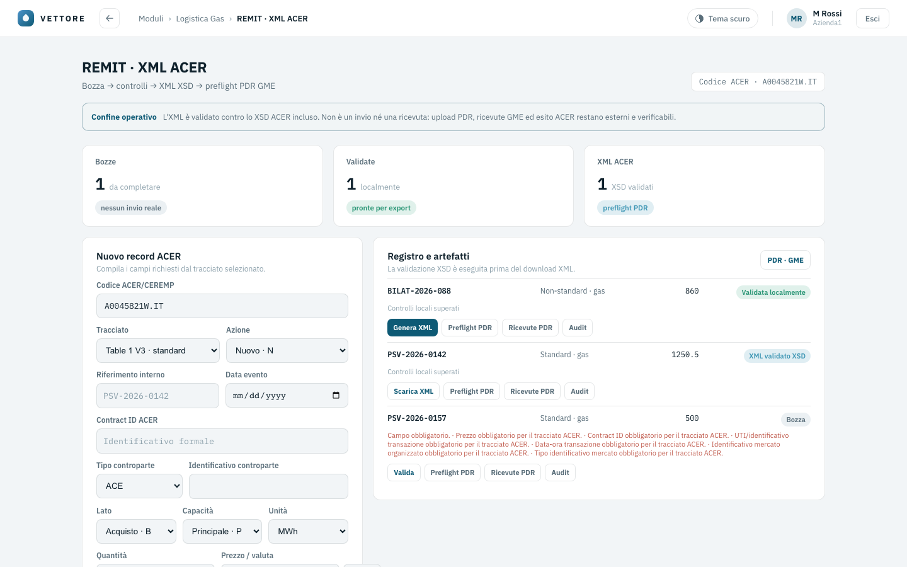<br>**REMIT · XML ACER** · registro nei tre stati, validazione XSD, UTI, audit ed export | 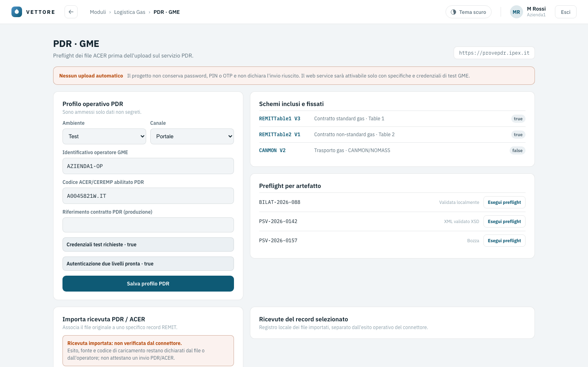<br>**PDR · GME** · profilo, schemi fissati, preflight per artefatto e ricevute |
| 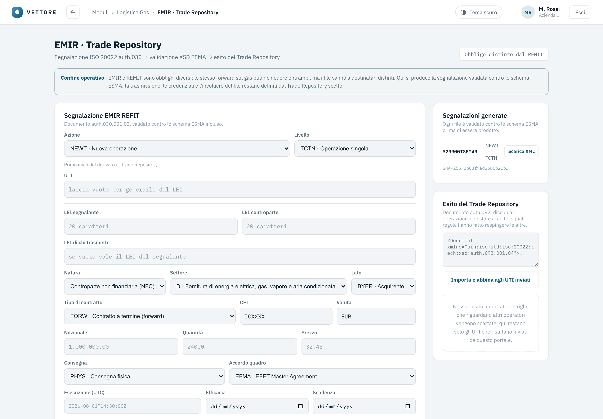<br>**EMIR · Trade Repository** · segnalazione ISO 20022 auth.030 ed esito del registro | |

E inoltre: **Capacità & Contratti** (anno termico, utilizzo, scadenze d'asta), **Stoccaggio** (giacenza, fattori di adeguamento Stogit, movimenti), **Report & Analisi** (filtri per categoria, invii programmati), **Nomine EDIG@S** (NOMINT validato contro gli schemi EASEE-gas, risposta NOMRES confrontata riga per riga, riscontro ACKNOW archiviato come prova con esito su ogni nomina), **REMIT · XML ACER** (bozze auditabili, Table 1 V3 / Table 2 V1, validazione XSD, generatore di UTI e Contract ID con l'algoritmo ufficiale ACER, preflight PDR), **EMIR · Trade Repository** (segnalazione ISO 20022 `auth.030` nelle otto azioni, validata contro gli schemi ESMA, esito `auth.092` abbinato agli UTI inviati), **PDR · GME** (readiness e controlli preliminari, senza credenziali locali né falso invio), **Impostazioni impresa** (anagrafica shipper, parametri di nomina, punti di consegna, notifiche).

> Screenshot e tour mostrano la **modalità demo** attiva per i dati di mercato; bozze REMIT, documenti EDIG@S con i riscontri e tessere regolatorie sono invece **dati reali** creati nel portale. Al primo avvio tutto parte pulito (vedi sotto).

## Dal design all'app funzionante

Questo progetto nasce da un design d'interfaccia completo e lo trasforma in una webapp reale **senza riscriverne l'interfaccia**: il markup del canvas è preservato al carattere.

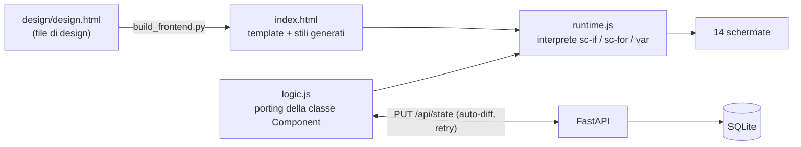
```mermaid
flowchart LR
    D["design/design.html<br>(file di design)"] -->|build_frontend.py| T["index.html<br>template + stili generati"]
    T --> R["runtime.js<br>interprete sc-if / sc-for / var"]
    L["logic.js<br>porting della classe Component"] --> R
    R --> UI["14 schermate"]
    L <-->|"PUT /api/state (auto-diff, retry)"| B["FastAPI"]
    B --> DB[("SQLite")]
```

- **`design/design.html`** — la fonte di verità dell'interfaccia.
- **`build_frontend.py`** — genera il frontend: converte gli pseudo-stili (`style-hover`/`style-focus`) in CSS e applica le poche deviazioni documentate (campi login controllati, effetto hover dell'hub in CSS puro).
- **`runtime.js`** (~150 righe, zero dipendenze) — interpreta il template a runtime: condizioni, cicli, interpolazioni, eventi.
- **`logic.js`** — porting quasi letterale della logica del canvas, con le deviazioni documentate in testa al file (API reali, persistenza, robustezza della sync).

Per modificare l'interfaccia: si aggiorna design/design.html e si rilancia `python3 build_frontend.py`. La CI verifica che il frontend generato resti allineato al design.

## Avvio — scegli la strada che preferisci

**Docker non è un requisito**: è solo una delle tre opzioni.

### 1 · Eseguibile pronto (niente da installare)

Scarica il file per il tuo sistema — [Windows](https://github.com/It-Energy-Ai/Logistica_Gas_Natural_Up_Stream/releases/latest/download/Vettore-windows.exe) · [macOS Apple Silicon](https://github.com/It-Energy-Ai/Logistica_Gas_Natural_Up_Stream/releases/latest/download/Vettore-macos-apple-silicon) · [Linux](https://github.com/It-Energy-Ai/Logistica_Gas_Natural_Up_Stream/releases/latest/download/Vettore-linux) — e fai doppio click: il browser si apre da solo su <http://localhost:8080>. Nessun Docker, nessun Python, nessun terminale. I dati restano in `~/.vettore/vettore.db`.

I collegamenti puntano sempre all'**ultima versione**: non serve cercarla fra le [release](https://github.com/It-Energy-Ai/Logistica_Gas_Natural_Up_Stream/releases). Attenzione a non confonderli con il pulsante verde *Code ▾ → Download ZIP* della pagina principale, che scarica il codice sorgente (`…-main.zip`) e non l'applicazione.

> macOS al primo avvio: tasto destro → *Apri* (il binario non è firmato). Windows: se SmartScreen avvisa, *Ulteriori informazioni → Esegui comunque*. **Mac Intel**: usa la strada 2 qui sotto. Ogni release include `SHA256SUMS.txt` per verificare l'integrità dei file.

### 2 · Script di avvio (serve solo Python 3.11+)

```bash
./avvio.sh        # macOS / Linux
avvio.bat         # Windows (doppio click)
```

Al primo avvio crea da solo l'ambiente e installa le dipendenze, poi apre il browser.

### 3 · Docker (per chi lo usa già)

```bash
docker compose up -d --build      # → http://localhost:8080
```

## Primo avvio pulito, demo su richiesta

Al primo avvio il portale è **pulito e tuo**: l'identità mostrata deriva dall'email con cui accedi, il giorno gas è quello reale, liste e contatori partono da zero, pronti per i dati veri.

I dati di scena che vedi negli screenshot (KPI, grafici, cicli, contratti) sono la **modalità demo**: si attiva con un interruttore in *Configuratore → Sistema*, popola il portale con l'ambientazione del design (ancorata al giorno gas 17/07/2026) e si spegne senza lasciare tracce — le nomine demo non vengono mai salvate nel tuo database.

| Reale | Demo (opzionale) |
|---|---|
| Identità dal login, navigazione, wizard, tema chiaro/scuro | Dati di mercato: KPI, prezzi PSV, giacenze, cicli |
| Sessioni con cookie, login/logout | Login e SSO accettano qualunque credenziale |
| **Tessere e contatori regolatori** (bozze REMIT, XML, documenti EDIG@S, avvisi): sempre dati veri | |
| **Persistenza SQLite** di nomine, configurazione, punti, utenti, audit REMIT e artefatti XML | Integrazioni Snam / SSO: interfacce pronte, nessuna chiamata ai sistemi veri |
| Sync client→server con retry, gestione sessione scaduta, validazione a whitelist | |

La colonna di destra è la mappa esatta di cosa sostituire per andare in produzione.

## REMIT e PDR GME

Il progetto genera file XML per i tracciati **ACER REMITTable1 V3** (TradeReport) e **REMITTable2 V1** (contratto non-standard a prezzo fisso), validandoli contro gli XSD ACER fissati nel repository. Per ogni export crea un nome file PDR con progressivo e conserva hash e audit locale.

Questo non equivale a una ricevuta GME o ACER. L'upload PDR resta disabilitato finché non sono disponibili contratto/abilitazione, credenziali di test a due livelli, specifiche del web service e un collaudo con ricevute reali. I tracciati EDIG@S di monitoraggio del trasporto gas (CANMON, NOMASS) restano bloccati, non simulati: ammettono come emittente solo il trasportatore. Le nomine che lo shipper deve invece inviare sono coperte, vedi sotto.

Le ricevute scaricate dall'operatore possono però essere **importate e tracciate**: il file XML/ZIP originale, la sua impronta SHA-256, il record REMIT e l'artefatto ACER associato restano immutabili, con evento di audit. Una ricevuta GME XML riconoscibile può fornire lo stato tecnico `Accept`/`Reject`/`Partial`; ogni importazione resta comunque marcata come manuale e non verificata dal connettore, finché non sarà configurato il canale PDR autorizzato.

Istruzioni, fonti ufficiali, versioni degli schemi e prerequisiti di esercizio sono in [docs/remit-pdr.md](docs/remit-pdr.md).

## Nomine EDIG@S

La schermata Nomine genera la **nomina di trasporto nel protocollo EDIG@S 6.1** (`Nomination_Document`, NOMINT), validata contro gli schemi ufficiali EASEE-gas inclusi nel repository, e legge la **risposta del trasportatore** (`NominationResponse_Document`, NOMRES) abbinandola da sola alla nomina che cita, con gli scostamenti riga per riga.

Il ciclo si chiude con il **riscontro di ricezione** (`Acknowledgement_Document`, ACKNOW): la prova con cui il trasportatore dichiara di aver preso in carico — o respinto — il documento. Viene validato, collegato da solo alla nomina che cita e archiviato con la sua impronta; i 63 codici di motivazione sono tradotti in italiano e l'esito distingue **accettato, accettato con riserva e respinto** (alcuni codici dicono letteralmente *accepted, but…*: mostrarli come rifiuti direbbe il contrario del vero). Ogni nomina in elenco porta il proprio stato, «in attesa di riscontro» compreso.

Sono coperti i quattro tipi di nomina — punto di connessione, PSV OTC, PSV borsa e cliente finale — ciascuno con i ruoli e la struttura che gli impone la decision table EASEE-gas. Il giorno gas è calcolato su `Europe/Rome`, quindi i giorni di cambio ora durano davvero 23 e 25 ore. I codici ammessi sono letti dagli XSD a runtime, non ricopiati nel codice.

Dettagli, tabelle dei codici e limiti dichiarati in [docs/edigas.md](docs/edigas.md).

## EMIR REFIT

La schermata **EMIR · Trade Repository** genera la segnalazione ISO 20022 del derivato (`auth.030.001.03`), validata contro gli schemi ufficiali ESMA inclusi nel repository, e legge l'esito del registro (`auth.092.001.04`) abbinandolo da solo agli UTI inviati, con le regole di validazione violate riga per riga.

È un modulo **separato dal REMIT**, con card, schermata e registro propri: sono due obblighi distinti verso destinatari distinti, e lo stesso forward sul gas può richiederli entrambi con identificativi generati in modi diversi.

Sono coperte tutte e otto le azioni — nuova operazione, modifica, correzione, componente di posizione, riattivazione, cessazione anticipata, aggiornamento della valutazione, annullamento per errore — ciascuna con la forma che le impone lo schema: nel tracciato EMIR il tipo di azione non è un campo ma il nome dell'elemento che avvolge la segnalazione, e il tipo di evento è obbligatorio in due casi, vietato in cinque. I codici delle tendine sono letti dai facet degli XSD a runtime e un test verifica che le traduzioni italiane coincidano esattamente con i valori ammessi: un codice inventato fa cadere la suite. Il LEI viene verificato con le sue cifre di controllo (ISO 17442, MOD 97-10), non con una semplice espressione regolare.

Restano fuori, dichiarati: l'involucro che unisce intestazione e messaggio in un unico file (ESMA non lo pubblica, lo definisce ciascun Trade Repository), la trasmissione, e la tabella completa delle *Validation Rules*. Dettagli e limiti in [docs/emir.md](docs/emir.md).

## Test e qualità

```bash
.venv/bin/pip install -r requirements-dev.txt
.venv/bin/pytest              # test API: sessioni, validazione, persistenza
node tests/logic.test.cjs     # test logica: navigazione, nomine, wizard, sync, avvio pulito
node tests/runtime.test.cjs   # test del runtime del template
```

Quasi quattrocento verifiche fra Python e Node: sessioni e isolamento per account, generazione XML REMIT con validazione XSD, algoritmo UTI sui 181 vettori ufficiali ACER, ciclo EDIG@S completo (NOMINT, NOMRES, ACKNOW — inclusa la riproduzione strutturale degli esempi ufficiali EASEE-gas), segnalazione EMIR nelle otto azioni con validazione contro gli XSD ESMA e copertura esatta delle enumerazioni, giorno gas ai cambi d'ora, progressivi PDR, audit, blocco dell'invio reale, runtime del template e sincronizzazione del frontend. Nessun input malformato deve produrre un errore interno: c'è una batteria che lo garantisce.

## Autore

**Davide Bellini** — ideazione, design dell'interfaccia e direzione del progetto.
Su GitHub: [It-Energy-Ai](https://github.com/It-Energy-Ai).

## Licenza

[MIT](LICENSE) · © 2026 Davide Bellini — It-Energy-Ai · Le versioni sono documentate nel [CHANGELOG](CHANGELOG.md).
